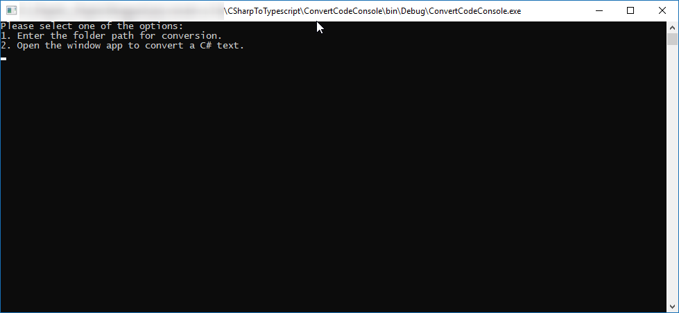

# CSharpToTypescript

----

**Original Repository:  joao-neves95/CSharpToTypescript forked from https://github.com/nhabuiduc/TypescriptSyntaxPaste**

Modified the library and built a small application that will : 
 1. Parse a folders and all of the subfoldes and generate TypeScript files from C# files. 
   If the transpiler will encounter any error - the file will still be generated and the file name will contain the '-error' in the name.
 2. Open a windows form where the C# code can be pasted and after clicking on 'Convert' button either the code will be transpiled or an error will be shown. 
   In the same manner the converted code or an error will replace the pasted code.
--- 

The application is a quick-and-dirty implementation.

### How to use CSharpToTypescript:

